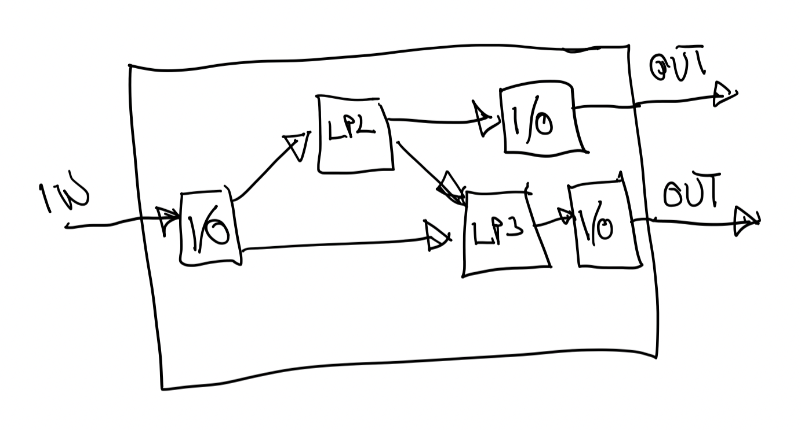

# multiprotocol-lp
Multiprotocol Liquidity Pools

## Demo

The demo video and description can be found [here](./demo/README.md).

## Abstract

Inspired by Uniswap V4, which hosts multiple Liquidity Pools in a single contracts, I expanded the concept to host various multiple protocols in a single pool. This minimizes the asset transfers calls even further without sacrificing safety. Through common accounting restrictions, additional safety is achieved, as well as additional safety of the protocols. Using these accounting restriction we show a great simplification of concentrated liquidity  implementation, lending, and even implementation of demanding restrictions that can be calculated off-chain and entered as ZK / validity proofs that are succinctly verified on-chain.

## Introduction

This protocol is inspired by Uniswap V4. In Uniswap V2 and V3, all Swap Liquidity Pools (LPs) were separate contracts, each holding a pair of assets:

When a route was presented to the protocol, tokens were transferred from one pool to another, through the entire route, adding unnecessary overhead. Uniswap V4 improved this by holding all LPs and all assets in a single pool. As the Swaps in the Route are executed, only the accounting is updated, and only the initial asset input and the final asset outputHowever,  (not necessary in this order) result in actual asset transfers:

I expanded this concept, to include various multiple protocols instead of just swaps:

These protocols can be swaps, lending, option protocols and other derivatives, etc. Each protocol has its own rules (constraints) that govern the accounting. As long as all protocols in the route satisfy their accounting constraints, the entire transaction executes, but if any constraint fails, the entire transaction reverts.

## Constraints

The constraints that govern the accounting implement the business logic of the member protocols.

These constraints can be implement in Solidity for simple logic, for example,
constant product Swap LP would just require that the product of the asset amounts
after its execution is larger or equal to this product before the execution.
For lending member protocols, the constraint would require that the overcollateralization
meets the demanding level, etc.

Some member protocols may involve complicated calculations, that involve looping
through history or other elaborate algorithms. In such cases,
Validity Proofs (ZK without "Z", ha ha) of the constraint satisfaction can be created
off-chain and the protocol would receive the ZK proof as input. The
on-chain calculation of the constraint would consist of merely
verification of the ZK proof created off-chain. I show such example that
implements a constant sum swap, even though this is an overkill. However,
in the same manner the ZK constraint circuit can represent elaborate calculations.

## Implementation

The implementation is running on multiple EVMs and it is written in Solidity. The sample ZK component’s prover is written in Aztec Noir. The Smart Contract that represents the multi-protocol LP is generic, and various protocols can be added as long as they implement our specific interface for creation, deposit/withdrawal and transactions. I also implemented the sample concentrated liquidity swap pool, lending pool and constant-sum ZK swap pool. The latter is the simplest example of ZK pool, but in reality, more complicated protocols can be implemented in this manner in order to save on gas by calculating the constraints off-chain.

## Benefits

### Isolation of assets

As the accounting is separated from the constraint implementation,
it does not allow one LP to affect the other LPs. LPs can be governed
by protocols that can potentially go bankrupt, for example lending protocols that
do not implement timely liquidations. If such LP goes bankrupt, the other LPs
will not be affected.

## Future work

### Multiple asset transfers per member protocol

Instead of having an input and an output, each member protocol can deal with multiple assets and have multiple inputs and outputs, thus turning the Route into a Directed Acyclic Graph (DAG). This would provide a more general functionality for multi-asset protocols:
 

### Flash Loans and Hooks

Implementation of flash loans would be extremely simple. The entire route would execute in a non-reentrant
manner. In it:
1. The outgoing assets would be paid out first.
2. The call-back for the usage of the flash-loaned assets can be called.
3. Finally, in a non-reentrant manner the accounting constraints can be evaluated and enforced.

If there is a need for multiple flash loan callbacks and/or hooks, the entire
above sequence can be executed multiple times.

The reentrancy guard would play the roll of a lock, if we use the
terminology of Uniswap V4.